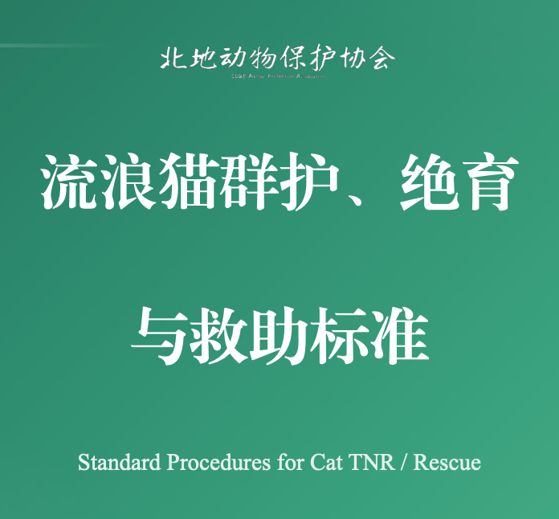

# campus-cat-tnr-sop

校园流浪猫群护绝育与救助标准（TNR SOP）  
Campus Community Cat TNR and Rescue Standard Operating Procedure

## 简介 | Short Description

本仓库发布《流浪猫群护绝育与救助标准》文档，用于支持校园及社区场景下的流浪猫群护、绝育（TNR）与救助工作的规范化执行。  
This repository provides the *Community Cat Protection, TNR, and Rescue Standard* to support standardized implementation in campus and community settings.

## 下载 | Download

- 标准文档 PDF / Standard Document (PDF): [流浪猫群护绝育与救助标准.pdf](./流浪猫群护绝育与救助标准.pdf)

## 适用范围与目的 | Scope and Purpose

- 适用范围：校园及周边社区的流浪猫群护、TNR 绝育管理与救助工作。  
  Scope: Community cat care, TNR sterilization management, and rescue operations on campuses and nearby communities.
- 目的：建立统一、可执行、可追踪的工作规范，提升动物福利与协作效率。  
  Purpose: Establish consistent, actionable, and traceable procedures to improve animal welfare and collaboration efficiency.

## 版本信息 | Version

- 版本 / Version: **2025.12**

## 发布机构 | Organization

- **北地动物保护协会 (CUGB Animal Protection Association)**

## 许可证 | License

_License information will be added in a future update._
